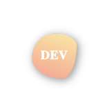
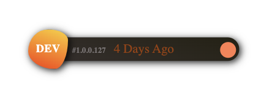
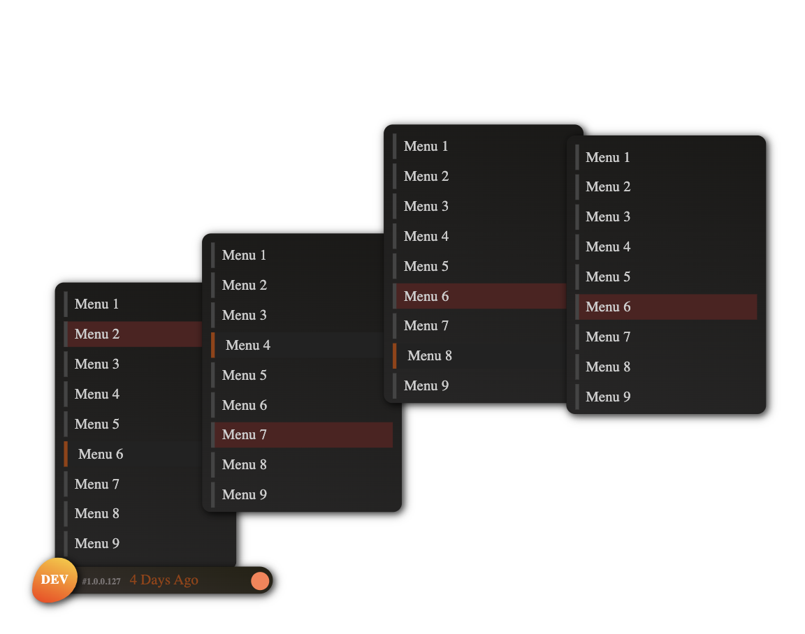

# React Developer Tools

### React atomic component for developers to show a floating toolbar and customisable children elements. 

##### double click the icon to activate the menu or click an dedicated menu icon after hover. 

### Installation
```
npm install react-developer-toolbar
```

### Syntax

```javascript
<ReactDeveloperTools
    environment = <String>
    version = <String>
    lastDeployed = <String>
>
    <element>
</ReactDeveloperTools>
```

## Screenshots

#### Default


#### Expanded


#### Extended


### Example
```javascript
<ReactDeveloperTools
    environment = "DEV"
    version = "#1.0,0,127"
    lastDeployed = "4 Days Ago" 
>
    <ul>
        <li>Menu 1</li>
        <li className="warning">Menu 2</li>
        <li>Menu 3
            <ul>
                <li>Menu 1</li>
                <li>Menu 2</li>
                <li>Menu 3</li>
                <li>Menu 4</li>
            </ul>
        </li>
        <li>Menu 4</li>
    </ul>
</ReactDeveloperTools>
```
